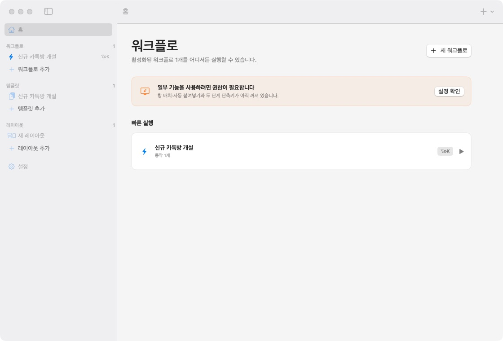

# Wikey

Wikey is a macOS app that bundles everyday tasks behind a shortcut.

Launch apps, open websites, paste rich templates, and arrange multiple windows across your displays. All settings stay on your Mac.



[한국어](README.md) · [Installation](docs/INSTALL.md) · [Privacy](docs/PRIVACY.md)

## Features

- Global single-chord shortcuts
- Two-step shortcut sequences
- App launching and URLs in the default browser
- Rich templates with formatting, links, lists, and inline images
- Copy-only and automatic paste modes
- Multi-display layouts with full, half, third, two-thirds, and quadrant zones
- Launch at login and quick access from the menu bar
- In-app update checks, downloads, and installation

Workflow actions run from top to bottom. If one action fails, Wikey records the failure and continues with the remaining actions when possible.

## Requirements

- macOS 15 or later
- Xcode and a Swift 6 toolchain when building from source

## Install

DMGs in GitHub Releases are currently unnotarized preview builds. macOS may show a warning that it cannot verify the developer. See [Installation](docs/INSTALL.md) for the current installation and permission steps.

Starting with Wikey 1.1.0, the app checks for updates once per day. You can also use **Wikey → Check for Updates…** or **Settings → Updates**. Version 1.0.0 has no updater, so it requires one final manual installation of 1.1.0.

Build and run from source:

```sh
./script/build_and_run.sh
```

Run tests:

```sh
swift test
```

To regenerate the Xcode project, install [XcodeGen](https://github.com/yonaskolb/XcodeGen), then run:

```sh
xcodegen generate
```

## Permissions

Wikey only asks for permissions needed by the features you use.

| Permission | Used for |
| --- | --- |
| Accessibility | Moving and resizing other app windows; automatic paste |
| Input Monitoring | Reading the second chord in a two-step shortcut |

Single-chord shortcuts, app launching, opening websites, and copying to the clipboard work without these permissions.

## Build a DMG

Create an ad-hoc signed DMG for local testing:

```sh
./script/package_release.sh 1.0.0 1
```

This produces `dist/Wikey-1.0.0.dmg` and its SHA-256 checksum. Once a Developer ID certificate and notary profile are available, the same script can sign and notarize the release:

```sh
WIKEY_CODESIGN_IDENTITY="Developer ID Application: Name (TEAMID)" \
WIKEY_NOTARY_PROFILE="wikey-notary" \
./script/package_release.sh 1.0.0 1
```

See [Distribution](docs/DISTRIBUTION.md) for the release checklist.

## Contributing

Bug reports and focused improvements are welcome. Read [Contributing](CONTRIBUTING.md) and the [Code of Conduct](CODE_OF_CONDUCT.md) before starting. Please report security issues through the process in [Security](SECURITY.md), not a public issue.

## License

[MIT License](LICENSE)
